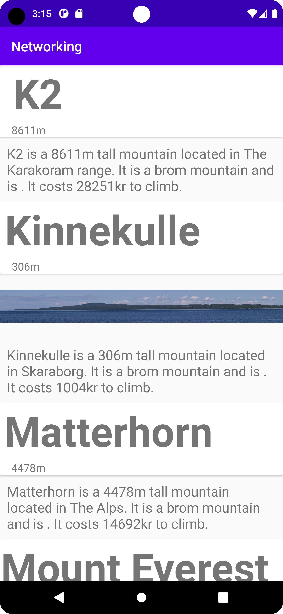

1. började med att skapa layouts


activity_main.xml
```
<?xml version="1.0" encoding="utf-8"?>
<androidx.constraintlayout.widget.ConstraintLayout xmlns:android="http://schemas.android.com/apk/res/android"
    xmlns:app="http://schemas.android.com/apk/res-auto"
    xmlns:tools="http://schemas.android.com/tools"
    android:layout_width="match_parent"
    android:layout_height="match_parent"
    tools:context=".MainActivity">


    <androidx.recyclerview.widget.RecyclerView
        android:id="@+id/RecyclerView"
        android:layout_width="0dp"
        android:layout_height="0dp"
        app:layout_constraintBottom_toBottomOf="parent"
        app:layout_constraintEnd_toEndOf="parent"
        app:layout_constraintStart_toStartOf="parent"
        app:layout_constraintTop_toTopOf="parent" />

</androidx.constraintlayout.widget.ConstraintLayout>
```


mountain_item.xml
```
<?xml version="1.0" encoding="utf-8"?>
<androidx.constraintlayout.widget.ConstraintLayout xmlns:android="http://schemas.android.com/apk/res/android"
    xmlns:app="http://schemas.android.com/apk/res-auto"
    xmlns:tools="http://schemas.android.com/tools"
    android:layout_width="match_parent"
    android:layout_height="wrap_content">

    <androidx.cardview.widget.CardView
        android:id="@+id/cardView"
        android:layout_width="match_parent"
        android:layout_height="wrap_content"
        tools:ignore="MissingConstraints">

        <androidx.constraintlayout.widget.ConstraintLayout
            android:layout_width="match_parent"
            android:layout_height="match_parent">

            <TextView
                android:id="@+id/textViewName"
                android:layout_width="wrap_content"
                android:layout_height="wrap_content"
                android:text="mountainName"
                android:textSize="60sp"
                android:textStyle="bold"
                app:layout_constraintEnd_toEndOf="parent"
                app:layout_constraintHorizontal_bias="0.056"
                app:layout_constraintStart_toStartOf="parent"
                app:layout_constraintTop_toTopOf="parent"
                tools:text="Berg" />

            <TextView
                android:id="@+id/textViewHeight"
                android:layout_width="wrap_content"
                android:layout_height="wrap_content"
                android:layout_marginTop="3dp"
                android:text="TextView"
                android:textSize="16sp"
                app:layout_constraintBottom_toBottomOf="parent"
                app:layout_constraintEnd_toEndOf="parent"
                app:layout_constraintHorizontal_bias="0.046"
                app:layout_constraintStart_toStartOf="parent"
                app:layout_constraintTop_toBottomOf="@+id/textViewName"
                app:layout_constraintVertical_bias="0.0" />

        </androidx.constraintlayout.widget.ConstraintLayout>

    </androidx.cardview.widget.CardView>

    <LinearLayout
        android:layout_width="match_parent"
        android:layout_height="wrap_content"
        android:orientation="vertical"
        app:layout_constraintTop_toBottomOf="@+id/cardView">

        <ImageView
            android:id="@+id/imageViewMountain"
            android:layout_width="wrap_content"
            android:layout_height="wrap_content"
            tools:srcCompat="@tools:sample/avatars" />

        <TextView
            android:id="@+id/textViewDesc"
            android:layout_width="wrap_content"
            android:layout_height="wrap_content"
            android:layout_margin="10dp"
            android:text="TextView"
            android:textSize="20sp" />
    </LinearLayout>

</androidx.constraintlayout.widget.ConstraintLayout>
```


2. skapade sedan min klass för berg


mountain.java
```
package com.example.networking;

import com.google.gson.JsonObject;

public class Mountain {
    String ID;
    String name;
    String type;
    String company;
    String location;
    String category;
    int size;
    int cost;
    JsonObject auxdata;

    @Override
    public String toString() {
        return (name + " is a " + size + "m tall mountain located in " + location + ". It is a " + type + " mountain and is " + category + ". It costs " + cost + "kr to climb.");
    }

    // getters
    public String getID() {
        return ID;
    }
    public String getName() {
        return name;
    }
    public String getType() {
        return type;
    }
    public String getCompany() {
        return company;
    }
    public String getLocation() {
        return location;
    }
    public String getCategory() {
        return category;
    }
    public int getSize() {
        return size;
    }
    public int getCost() {
        return cost;
    }
    public JsonObject getAuxdata() {
        return auxdata;
    }

    public String getImage() {
        return auxdata.get("img").getAsString();
    }
}
```

3. skapade min adapter
```
package com.example.networking;

import com.google.gson.JsonObject;

public class Mountain {
    String ID;
    String name;
    String type;
    String company;
    String location;
    String category;
    int size;
    int cost;
    JsonObject auxdata;

    @Override
    public String toString() {
        return (name + " is a " + size + "m tall mountain located in " + location + ". It is a " + type + " mountain and is " + category + ". It costs " + cost + "kr to climb.");
    }

    // getters
    public String getID() {
        return ID;
    }
    public String getName() {
        return name;
    }
    public String getType() {
        return type;
    }
    public String getCompany() {
        return company;
    }
    public String getLocation() {
        return location;
    }
    public String getCategory() {
        return category;
    }
    public int getSize() {
        return size;
    }
    public int getCost() {
        return cost;
    }
    public JsonObject getAuxdata() {
        return auxdata;
    }

    public String getImage() {
        return auxdata.get("img").getAsString();
    }
}
```

4. skrev om min MainActivity

```
package com.example.networking;

import android.os.Bundle;
import android.util.Log;

import androidx.appcompat.app.AppCompatActivity;
import androidx.recyclerview.widget.LinearLayoutManager;
import androidx.recyclerview.widget.RecyclerView;

import com.google.gson.Gson;
import com.google.gson.reflect.TypeToken;

import java.lang.reflect.Type;
import java.util.ArrayList;
import java.util.List;

@SuppressWarnings("FieldCanBeLocal")
public class MainActivity extends AppCompatActivity implements JsonTask.JsonTaskListener {

    private final String JSON_URL = "https://mobprog.webug.se/json-api?login=brom";
    private final String JSON_FILE = "mountains.json";


    @Override
    protected void onCreate(Bundle savedInstanceState) {
        super.onCreate(savedInstanceState);
        setContentView(R.layout.activity_main);

        new JsonTask(this).execute(JSON_URL);
    }

    @Override
    public void onPostExecute(String json) {
        Log.d("MainActivity", json);

        Gson gson = new Gson();
        Type listType = new TypeToken<ArrayList<Mountain>>(){}.getType();
        List<Mountain> mountains = gson.fromJson(json, listType);

        for (Mountain mountain : mountains) {
            Log.d("BRAH", mountain.toString());
        }

        RecyclerView recyclerView = findViewById(R.id.RecyclerView);

        mAdapter adapter = new mAdapter(this, mountains);

        recyclerView.setAdapter(adapter);
        recyclerView.setLayoutManager(new LinearLayoutManager(this));

        adapter.notifyDataSetChanged();

    }

}
```

screenshot:


